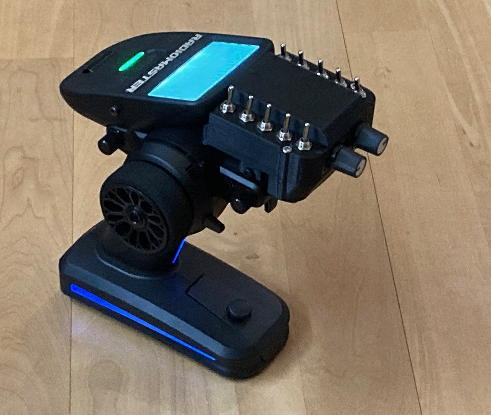
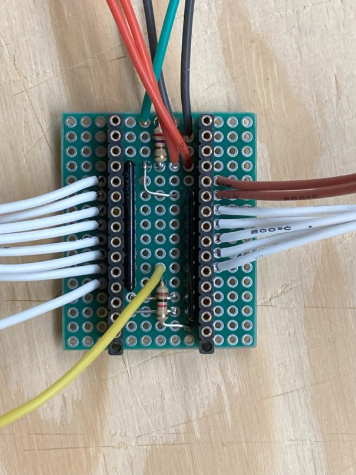
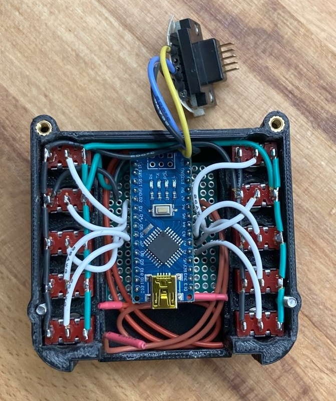

# Schaltpult Ardu Nano
# Schaltererweiterung für openTX und EdgeTX Sender

 

Entwickelt wurde die Schaltung für die Möglichkeiten von OpenTX und EdgeTX Fernsteuerungen.  
 
Anschlüsse für bis zu 14 zusätzliche Schalter und 2 Potis.  
Schalteingänge mit diesen Schalterkonfigurationen sind, beliebig kombiniert, nutzbar:  
•  2-Pos-Schalter  
•  3-Pos-Schalter  
•  Einfache Taster  
•  Doppeltaster (2 Taster auf einem Eingang)  

Details siehe "DOCS"

Dies ist die aktualisierte Version von https://github.com/Tiefflieger68/Schaltpult-fuer-openTX-Sender  
auf Basis eines Arduino Nano.  
 
Die Schaltung erzeugt ein 16-Kanal PPM oder SBUS Signal.  
PPM wird über die Trainer-Buchse oder den externen Modulschacht,    
SBUS wird über den Serial Port oder den externen Modulschacht in den Sender eingespeist.

Je nach Protokoll, stehen verschiedene Binarys zur Verfügung  
- PPM: 16-Kanal PPM Signal  
- SBUS: Standard SBUS (Modulschacht)  
- SBUS UART: SBUS für non-inverted UART (Serial Ports)  

 
Der Code wurde mit BASCOM-AVR erzeugt.  
Siehe "Source" und "Binary"

Support-Forum:  
https://www.rc-network.de/threads/schaltpult-nautik-modul-f%C3%BCr-frsky-opentx-sender.690399/  
und  
https://www.rockcrawler.de/thread/52817-abnehmbare-schaltererweiterung-f%C3%BCr-radiomaster-mt12/?pageNo=1  

Eine Materialliste findest Du hier: https://www.reichelt.de/my/2115155  

Neben dem Arduino Nano sind nur wenige Bauteile nötig  

Auch fertig verdrahtet bleibt es übersichtlich  

# English:  
By now, all documents are written in German. I will support English requests as well  